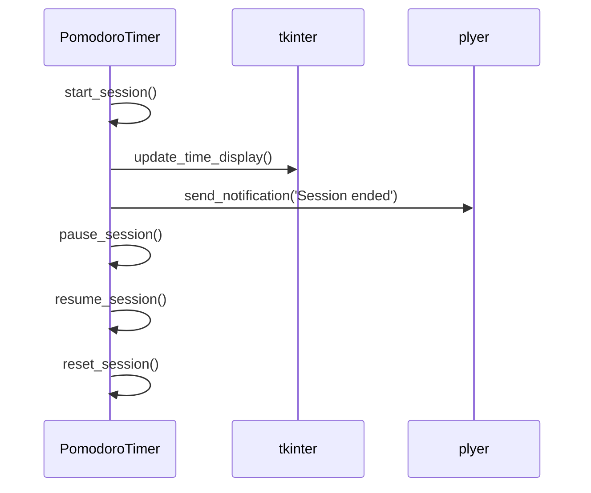

## Code Review

The code provided seems well-structured and follows the requirements specified in the system design and task sections. Here are some points to consider for further improvement:

1. The `update_time_display` method in the `PomodoroTimer` class is currently a placeholder. You may need to implement this method to update the UI with the current session time.

2. The logic for updating the UI with the session time is missing. You may need to add this logic to ensure the timer display reflects the correct time.

3. The `PomodoroTimer.py` file should contain the `PomodoroTimer` class definition, and the `main.py` file should handle the main logic for the Pomodoro timer and UI interactions. This separation of concerns is good practice and should be maintained.

4. Ensure that all necessary error handling and edge cases are considered in the implementation to make the application robust.

## Call flow



## Summary

The code implements a Pomodoro timer using tkinter for the UI and plyer for notifications. The `PomodoroTimer` class manages session logic and notifications, with separate files for class definition and main logic. The UI elements are created and linked to the timer functions appropriately.

## TODOs

```python
{
    "PomodoroTimer.py": "Implement the update_time_display method",
    "main.py": "Add logic for updating the UI with session time"
}
```